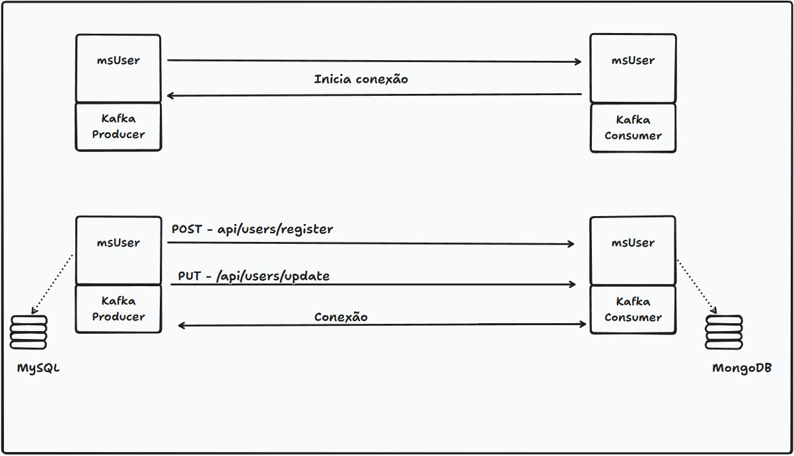
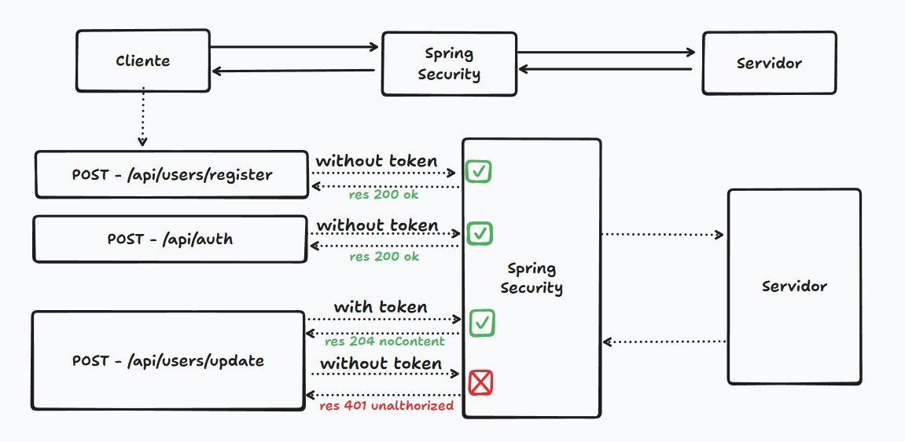
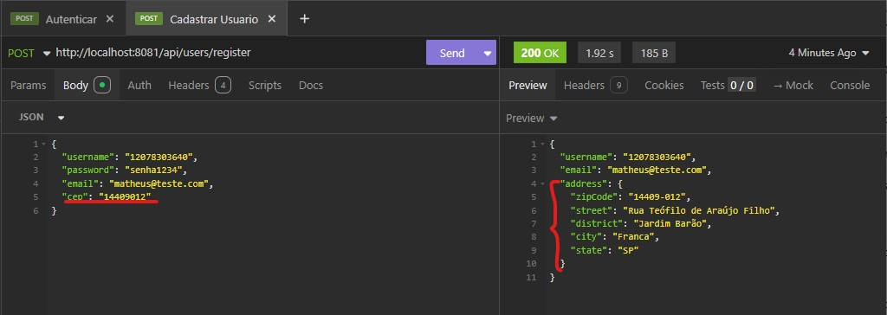
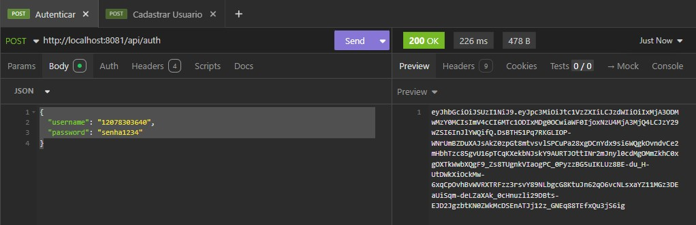
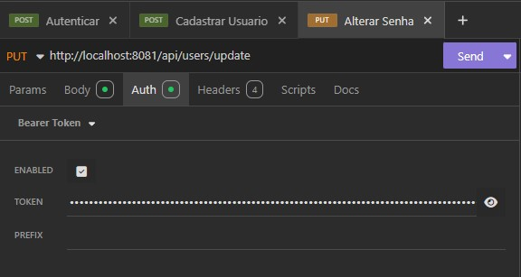
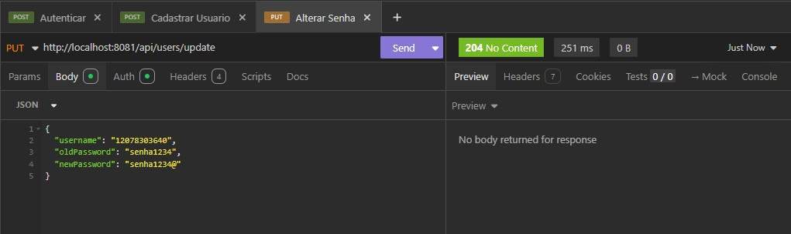
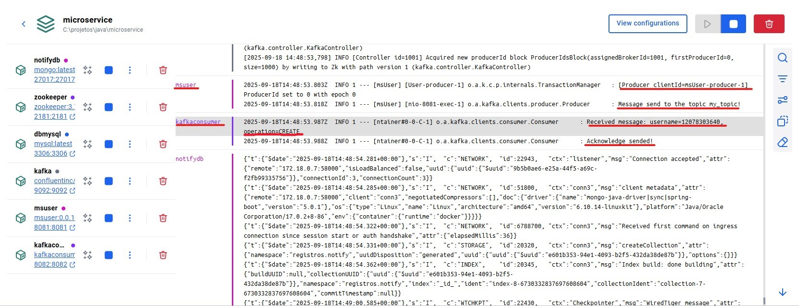
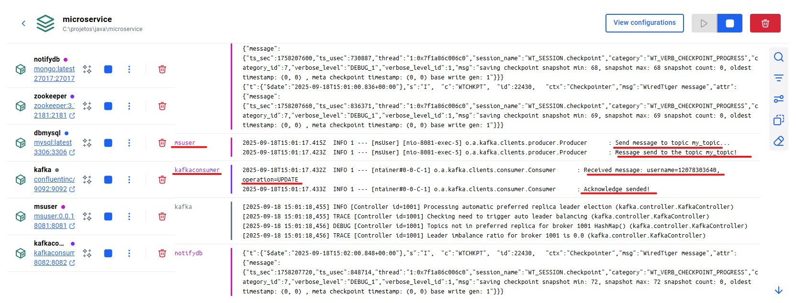

# Microsserviços com Spring Boot e Kafka

## Objetivo

Este projeto tem como finalidade aplicar conceitos de **arquitetura de microsserviços** 
utilizando as tecnologias da stack backend com Java e Spring Boot. A ideia geral está
em construir dois microsserviços que comuniquem entre si através de uma mensageria. 


## Tecnologias e Ferramentas

* **Java Development Kit (JDK 17)**
* **Spring Boot 3**
* **Spring Security + JWT**
* **Spring Data JPA**
* **MySQL 8**
* **MongoDB**
* **OpenFeign** (consumo da API ViaCEP)
* **Apache Kafka**
* **Docker & Docker Compose**

---

## Funcionalidades:

* Desenvolvimento de **dois microsserviços**:
    - **Serviço de Usuários** → responsável pelo cadastro, gerenciamento de usuários e configuração do Producer do Kafka.
    - **Serviço de Mensageria** → responsável por receber e armazenar mensagens .
* Integração com a **API ViaCEP** para preenchimento automático de endereço.
* Implementação de **autenticação e autorização via JWT** para proteção dos endpoints.
* Comunicação entre microsserviços utilizando **Apache Kafka**.
* **Dockerização** da aplicação com `docker-compose`.

---

## Como usar
1. Baixar ou fazer clone do repositório. 
2. Configurar ambiente:
   - **msUser**:
     - Criar e configurar o application.yml seguindo o application-example.yaml. 
     - Criar chaves RSA pública(app.pub) e privada(app.key), você pode usar o OpenSSL para gerar as chaves.
   - **kafkaConsumer**:
     - Criar e configurar o application.yml seguindo o application-example.yaml.
3. Abrir o terminal do Docker Desktop, navegar até o diretório raíz do projeto e rodar:
``` 
        docker compose up -d --build
```

---

## Demonstração
A mensageria foi configurada para enviar apenas mensagens do Serviço de Usuários para o
Serviço de Mensageria. O **Producer** foi configurado no microservice **msUser** que 
envia mensagens ao **kafkaConsumer** que seria o **Consumer** configurado. 


Na camada de segurança com Spring Security foi configurado para liberar os endpoints de
registro e autenticação. O endpoint de atualização de dados cadastrados só está 
acessível por meio de autorização com Token JWT.


---

### Testes de Endpoints com Insomnia

Os endpoints criados foram testados utilizando o **Insomnia**. Na pasta [content](./content)
deste repositório tem uma coleção .yaml que pode ser importada para testes.

* **Registro de Usuário** (`POST /api/users/register`). Observe que o auto-preenchimento
do endereço está sendo feito corretamente através da API externa ViaCep. Basta passar o CEP.

  


* **Autenticação de Usuário** (`POST /api/auth`)

  


* **Atualização de Senha** (`PUT /api/users/update`)

  
  <br>
  

---

### Docker em execução

Após rodar o comando `docker compose up -d --build`, os containers dos microserviços,
do Kafka, Zookeeper e dos bancos de dados MySQL e MongoDB são iniciados. <br>
A imagem abaixo mostra os logs do Docker Desktop quando um novo usuário é registrado.
Observe que assim que o **msUser** envia uma mensagem, o **kafkaConsumer** já recebe a notificação. <br>



A imagem abaixo mostra os logs do Docker Desktop quando é feita uma atualização no cadastro de um usuário.


---

